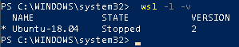

# Setup WSL 2 on Windows 10
A guide on setting up WSL 2 on Windows 10

## NOTE

First go and follow my guide on how to setup [WSL 1 on Windows 10](https://github.com/BeanGreen247/Setup-WSL-on-Windows-10) in order for this to work.

## Step 0

To update to WSL 2, you must meet the following criteria:

* Running Windows 10, updated to version 2004, Build 19041 or higher.

* Check your Windows version by selecting the Windows logo key + R, type `winver`, select OK. (Or enter the `ver` command in Windows Command Prompt). Please update to the latest Windows version if your build is lower than 19041.

## Step 1

Enable the 'Virtual Machine Platform' optional component
Before installing WSL 2, you must enable the "Virtual Machine Platform" optional feature.

Open PowerShell as Administrator and run:
```
dism.exe /online /enable-feature /featurename:VirtualMachinePlatform /all /norestart
```

Restart your machine to complete the WSL install and update to WSL 2.

## Step 2

Set WSL 2 as your default version

Run the following command in PowerShell to set WSL 2 as the default version when installing a new Linux distribution:
```
wsl --set-default-version 2
```
To set a distro to a specific version of WSL run
```
wsl --set-version <distribution name> <versionNumber>
```
Example
```
wsl --set-version Ubuntu-18.04 2
```
To check the wersion
```
wsl -l -v
```
Output


